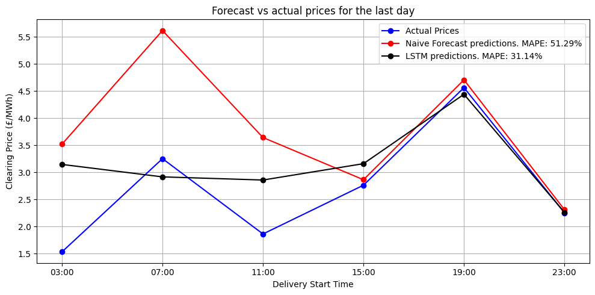

# Price forecasting for Energy Auction Prices

This repository provides a package along with example codes to forecast *Dynamic Containment Low (DCL)* auction prices in the British electricity market.
The modelling pipeline includes feature engineering after statistical data analysis, model development (LSTM) and evaluation, hyperparameter tuning via an optimisation routine, and long-term performance comparison against traditional benchmarks.

## Key Results

  
  

